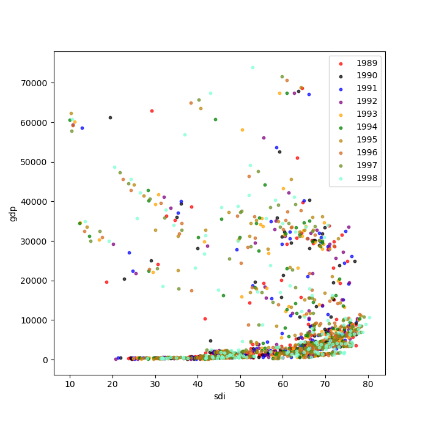
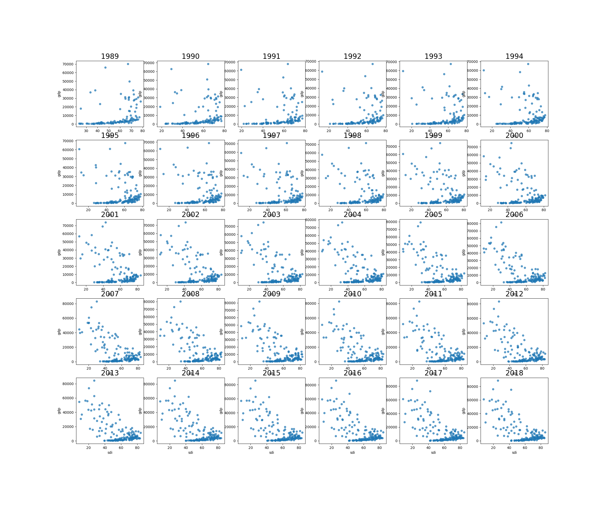
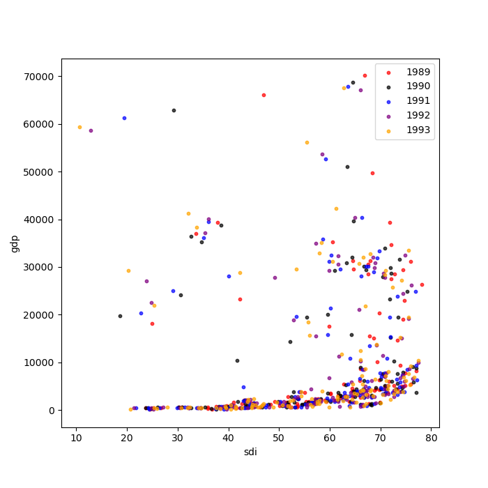
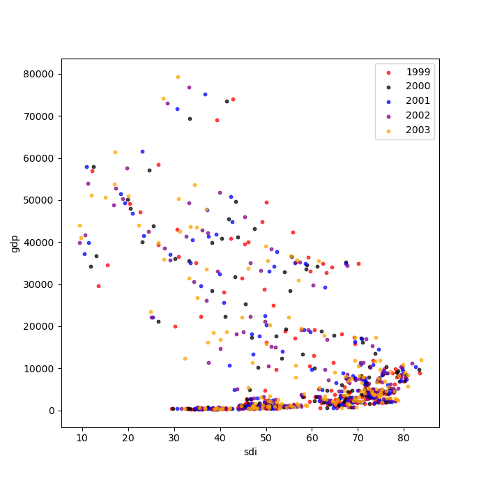
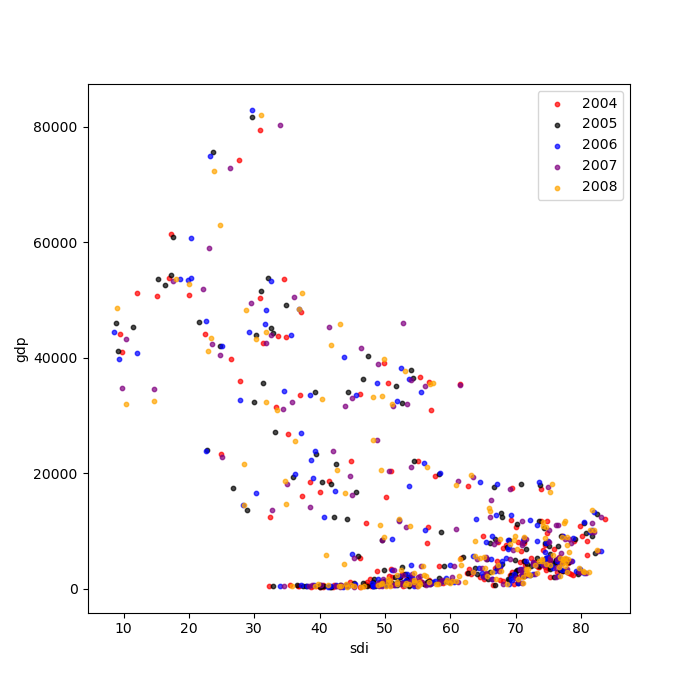
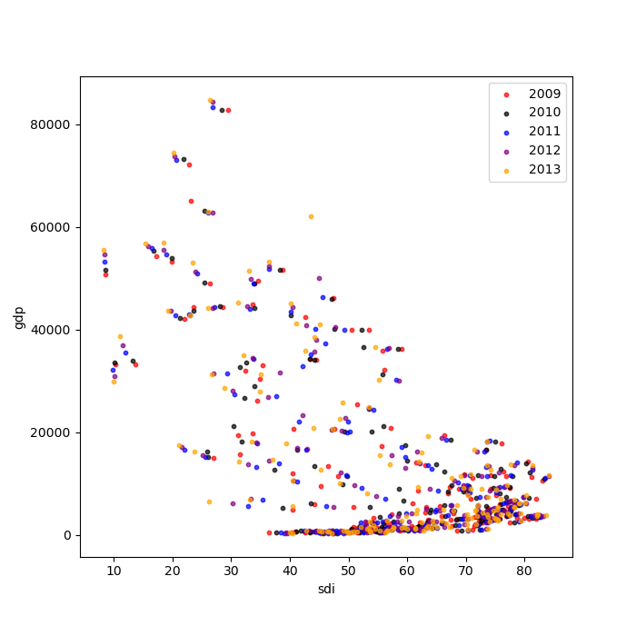

--- 
title: Correlation between GDP and Sustainable Development Index (SDI)
date: Mar. 2022
author: Thomas French
geometry: margin=1.25in
---


# Data Selection

I chose the GDP and SDI data set. The SDI(Sustainable Development Index) is . I though that the richer countries would have higher sustainablilty development since they can spend more money on enviromental protection projects. 

I also though it would be funny to see if there a few very rich countries that were very unenviromentally concious. 
And then I could blame them for all my problems :)

# Data Processing

## Flitering Data
To process the data I started by uploading then filtering the two data sets. since they were completely different data they had data for different number of countries on different years.
<br><br>

### Code:
```python
for h in range(0,220):
    cond = dfgdp2['country'].isin(df['country'])
    dfgdp2.drop(dfgdp2[cond].index, inplace = True)
for h in range(0,220):
    cond = dfgdp['country'].isin(dfgdp2['country'])
    dfgdp.drop(dfgdp[cond].index, inplace = True)


for h in range(0,220):
    cond = df1['country'].isin(dfgdp['country'])
    df1.drop(df1[cond].index, inplace = True)
for h in range(0,220):
    cond = df['country'].isin(df1['country'])
    df.drop(df[cond].index, inplace = True)


dfgdp.drop(dfgdp.iloc[:, 1:31], inplace = True, axis = 1)
dfgdp.drop(dfgdp.iloc[:, 31:32], inplace = True, axis = 1)
```
<br><br><br>
## Replacing K with 1000
For the GDP I also had to convert all the K into 1000. This was espicially difficult since there was some data that had decimal points then a K. I replaced the K's with a "* 1e3" then I evaluated the value of each frame. 
<br><br>

### Code:
```python
dict_=list(dfgdp.columns)
dict_.remove('country')

for h in range(0,30):
    dfgdp[dict_[h]]=dfgdp[dict_[h]].replace({"k":"*1e3"}, regex=True).map(pd.eval).astype(int)
```

# Displaying the Data
I displayed the data by putting it all in one grid with different colors for each year but there are too many years to see the difference or if there is any trend between years.

refer to figure 1



<br><br>

After that I created a loop to graph a grid of SDI vs GDP each point being a country and each frame in the grid being a different year. 

refer to figure 2



Still the graphs are very small. So I create graphs just like the first one but with 5 years each.

refer to figures 3-7










After that I tried to group the very high GDP per capita countries that also have very low SDI. It was I ended up creating a new data frame then I found the worst country for GDP/SDI for each year

|The Worst Country|The Year|
|--------------------|-----|
|Bahrain             |1989 |
|Qatar               |1990 |
|Rwanda              |1991 |
|Rwanda              |1992 |
|Singapore           |1993 |
|Singapore           |1994 |
|Singapore           |1995 |
|United Arab Emirates|1996 |
|Singapore           |1997 |
|Singapore           |1998 |
|United Arab Emirates|1999 |
|Singapore           |2000 |
|Singapore           |2001 |
|Singapore           |2002 |
|Singapore           |2003 |
|United Arab Emirates|2004 |
|Singapore           |2005 |
|Singapore           |2006 |
|Singapore           |2007 |
|Kuwait              |2008 |
|Singapore           |2009 |
|Singapore           |2010 |
|Singapore           |2011 |
|Singapore           |2012 |
|Singapore           |2013 |
|Singapore           |2014 |
|Singapore           |2015 |
|Singapore           |2016 |
|Singapore           |2017 |
|Singapore           |2018 |


# Conclusion
I found that the lower GDP per capita countries, those under ~10,000 USD, have a possitive correlation throughout all the years. However, the richer countries started with positive correlation but as time went on the correlation shifted to negetive, with richer countries have a lower SDI. 

Also I found Singapore is the worst country :)

